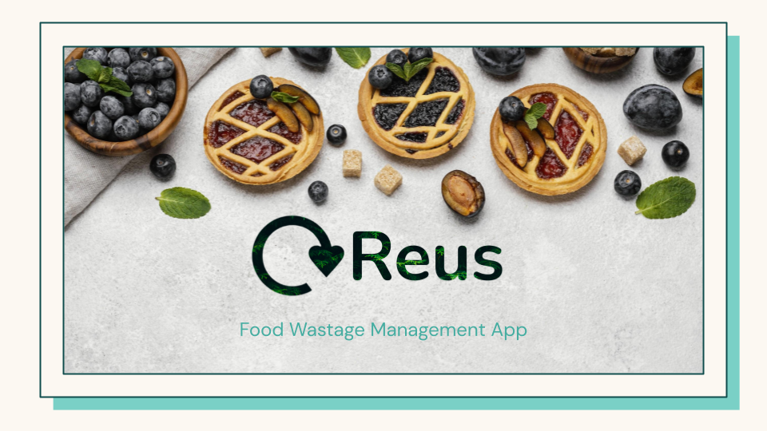
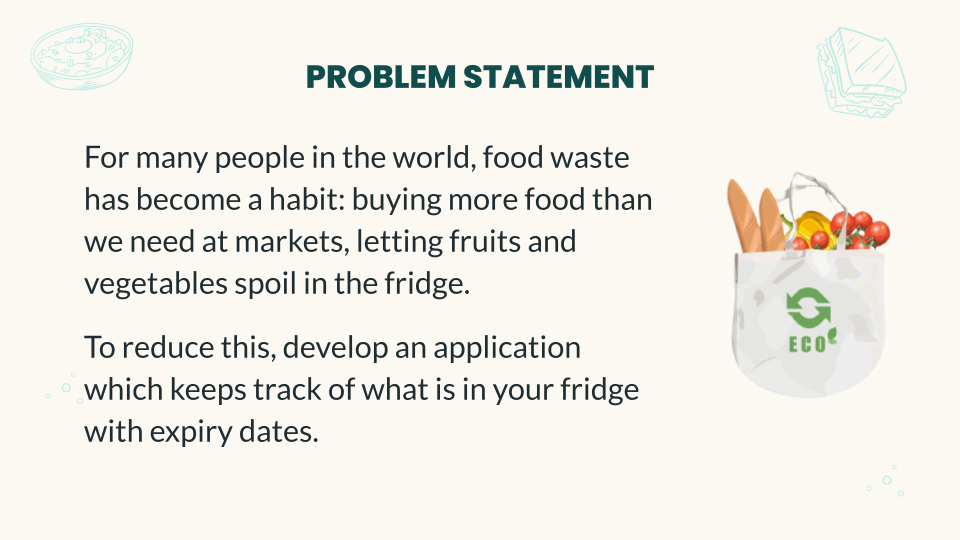
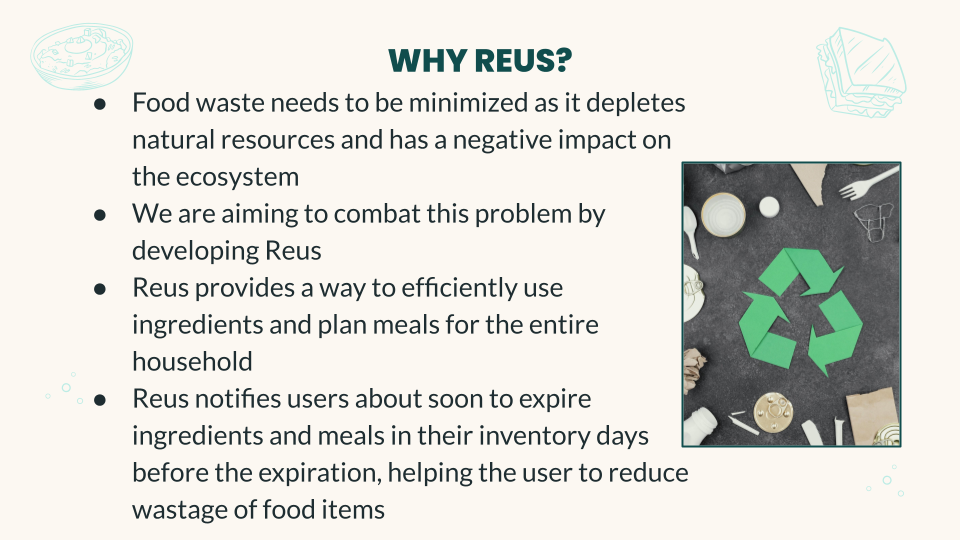
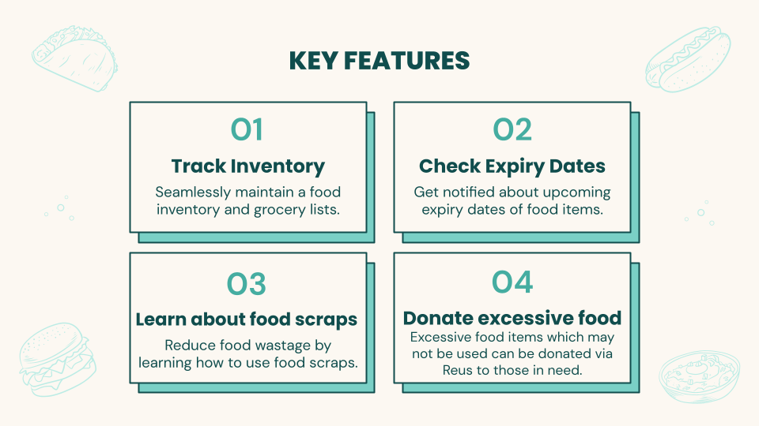
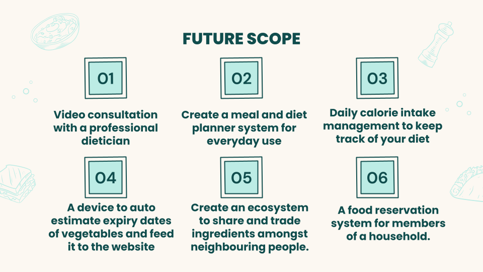
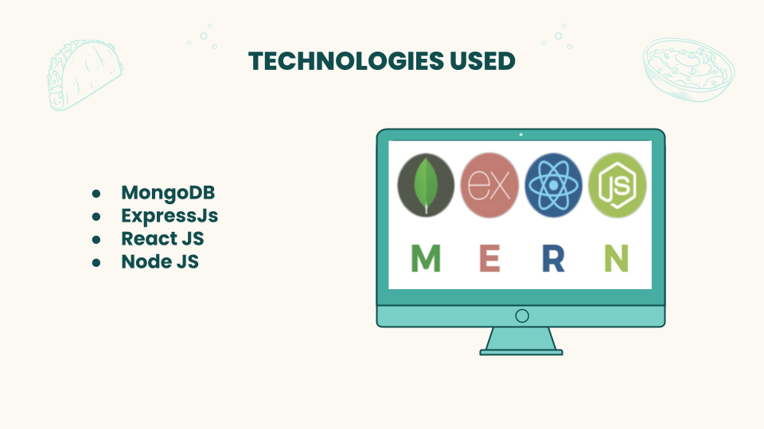

<h1 align="center">Reus</h1>

A food wastage and management web app that tracks inventory and notifies the user on expiry of products like fruits and vegetables. It also suggests recipes based on items in the inventory. 

 [Click Here](https://drive.google.com/file/d/18VRBd37YY6IctTqDD1vqdrnzY_aZt_lV/view?usp=sharing) for a project demo video

 

 

 

 

 

 

